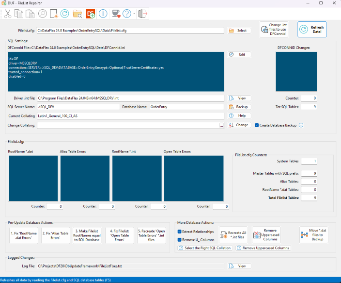

# DUF - DbUpdateFramework
 Database Update Framework for DataFlex

The Database Update Framework is a code based framework for making automated database updates. It is designed to make it easy to update databases at customer site when e.g. installing a new revision of a software that depends on changes have been made to the database before the new software version can run.

IMPORTANT:
It is suggested to read the following help sections; “Welcome to the Database Update Framework”, “Workspace Setup” and “How to Use It” in the Developer5.chm Help file (/Help folder).

You can copy the Developer5.chm help file to the DataFlex Help folder(s) under “Programs Files (x86)”. This will integrate the Database Update Framework help with the DataFlex Studio's help system.

You don't need to use the "DUFSQLConnections.exe" program if you don't plan to use DAW's "SQL Connection Manager". If needed add the "DUFSQLConnections.exe" program to the Studio’s Tools menu, by running the program and pressing the “Add To Studio” buttons.
There is probably only two programs you need to compile and use: "DUFCodeGenerator" and "DUFFileListRepair". See also "WriteDateTimeHeaderFile" below.
It is suggesed to add the "DUFCodeGenerator.exe" and "DUFFileListRepair.exe" programs to the Studio’s Tools menu, by running them and pressing the “Add To Studio” button.

NOTE: When you compile one of the programs for the first time and you get e.g. this compile error: "Error 4295: C:\Temp\DUF\AppSrc\DUFFileListRepair.src (ln 538) Can't include resource COMPILEHEADER.H",
      You will need to first compile/create the program: "WriteDateTimeHeaderFile". It creates the "COMPILERHEEADER.H" file automatically and is used by the programs to get the compiled date & time.

The workspace now uses other RDC Tools libraries that are also published at GitHub. This should not be of any concern to you as this should all be automatic when cloning this repository.
